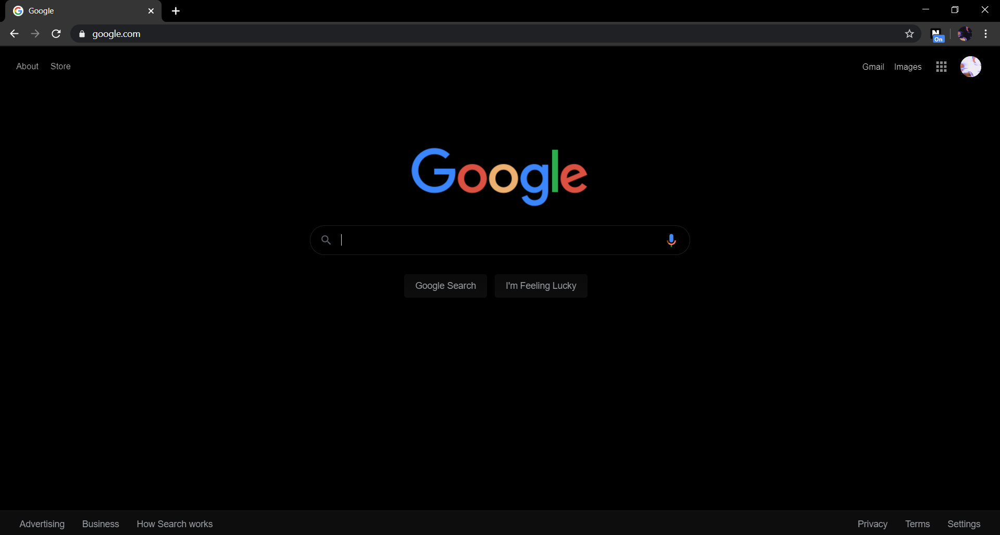
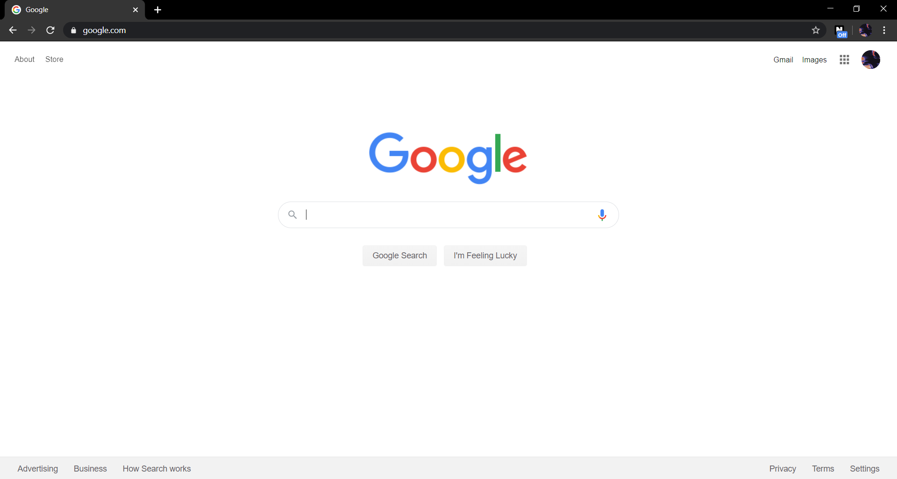

# Nightify
  Nightify is a chrome extension that turns all websites into high contrast mode.
 It has 2 modes, default and high contrast. It is not on the extension store so if you want to try it follow my steps below.
You can toggle through the modes by clicking on the extension icon. 
 
<h2>Installation:</h2>
1. Download this project off Github and unzip it 
2. Open Chrome and go to chrome://extensions 
3. Toggle on developer mode (top right of screen) and click Load Unpacked 
4. Choose nightify's folder which you unzipped 
5. Done 

 
This is how it looks:  
<h2>On</h2> <h2>Off</h2> 
 

