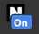
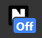

# Nightify
  Nightify is a chrome extension that turns all websites into high contrast mode.
 It has 2 modes, default and high contrast.

Installation:
1. Download this project off Github and unzip it 
2. Open Chrome and go to chrome://extensions 
3. Toggle on developer mode (top right of screen) and click Load Unpacked 
4. Choose nightify's folder which you unzipped 
5. Done 
 
How it looks:
 
You can toggle through the modes by clicking on the extension icon: 
On Off 
This is how it looks on Google: 
On Off 

